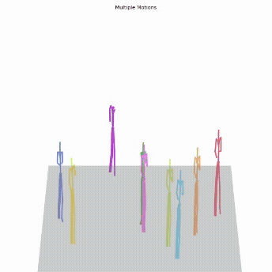
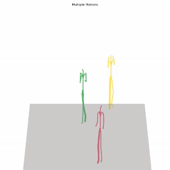
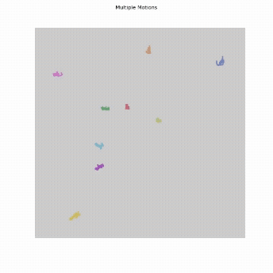
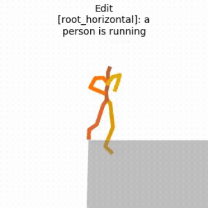

# Crowd Motion Generation

🎬 This project generates realistic, text-driven crowd movement animations. It uses trajectory extraction from trace data, applies root masks, and leverages diffusion models (MDM) to generate coherent and diverse paths, producing high-quality animated results.

## 🧠🌐 How It Works

1. **🎯 Extract Root Trajectories (Trace):** The system sets the root mask by extracting agent trajectories from real-world/simulated crowd data (Trace). This defines the basic movement path for each agent.
2. **✨ Motion Generation (MDM/Diffusion Models):** With the root masks fixed, the MDM diffusion model generates detailed human motion along each path, ensuring realistic and coherent agent behaviors matching the crowd context and text prompts.
3. **🎞️ Output & Visualization:** The resulting motions are animated and visualized as GIFs for easy inspection, with each output demonstrating natural group movement and scenario alignment driven by your text or config input.

## 🎞️ Example Animations

Below you can see examples of generated crowd motions and activities:

| 🏃 Running Crowd              | 👐 Raising Hands Crowd           | 🤼 Fighting Crowd               | 🧍 One Person (Reference)            |
|------------------------------|----------------------------------|----------------------------------|---------------------------------------|
|  |  |  |  |

## 📦 Pipeline Overview

- **🎯 Root Mask (from Trace):** Sets the spatial path for each agent.
- **✨ MDM Diffusion Model:** Fills in realistic, coherent human movement details onto each path, maintaining scene context coherence.
- **🎞️ Animations:** Synthesized as shareable GIFs for qualitative assessment.

## 🚀 Getting Started

- Install the requirements (Python 3.x, see code for `numpy`, `matplotlib`, `h5py`, and `moviepy` if you want to generate new GIFs yourself).
- Run the pipeline via `integration/src/generate_traces.py` to generate new crowd trajectories and prepare new visualizations.

## 📚 References & Context

- **TRACE & PACE (NVIDIA):**
  - TRACE (Trajectory-aware Control for Realistic Animation) is a planner for plausible pedestrian and crowd motion paths that accounts for interactions, group behaviors, and the environment. PACE (Pedestrian Animation with Controllable Environment) synthesizes lifelike human movement along these paths. [Learn more](https://research.nvidia.com/labs/toronto-ai/trace-pace/supp.html?utm_source=openai)
- **PriorMDM (Guy Tevet et al.):**
  - PriorMDM (Prior Motion Diffusion Model) uses diffusion models and a learned prior to generate coherent, realistic motion for complex agents from textual descriptions or other constraints. This provides scene- and prompt-consistent, group-aware movement.

> **This project:** Sets root masks using TRACE-like trajectory data, then generates full agent motion with PriorMDM-like diffusion, resulting in synchronized, semantically-driven crowd animations as illustrated above.

---
All components referenced above are original; folders such as `priorMDM/` and `trace/` are provided as external dependencies only.
